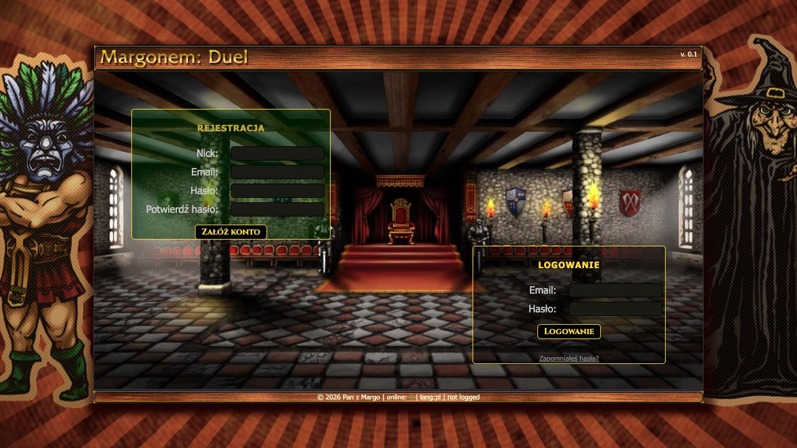
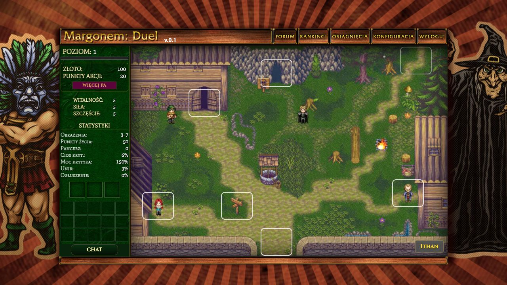

# Margonem: Duel

Przeglądarkowy RPG-duel inspirowany klasycznym frontendowym prototypem. Ta wersja jest przepisana na Laravel, Vue, Inertia i TypeScript, z normalnym backendem, autoryzacją, bazą danych, kolejkami oraz realtime przez Reverb.

<p align="center">
  
</p>

<p align="center">
  
</p>

## Stack

- PHP 8.4, Laravel 13, Laravel Sail
- Vue 3, Inertia, TypeScript, Vite
- MySQL 8.4, Redis, Horizon
- Laravel Reverb i Echo do realtime odświeżania punktów akcji
- Docker Compose dla developmentu i osobny production compose dla deploya
- GitHub Actions deployujące obraz na serwer

## Wymagania

- Docker z Compose
- PHP 8.4 i Composer lokalnie, tylko do pierwszego `composer install`
- Node.js 20+, jeśli chcesz odpalać frontend poza Sailem

Najwygodniej pracować przez Sail, wtedy PHP, MySQL, Redis, Horizon i Reverb siedzą w kontenerach.

## Instalacja Lokalna

```bash
composer install
cp .env.example .env
```

W `.env` ustaw wartości pod Saila:

```dotenv
APP_NAME="Margonem: Duel"
APP_ENV=local
APP_DEBUG=true
APP_URL=http://localhost:8123
APP_PORT=8123
VITE_PORT=5173
APP_FORCE_HTTPS=false

DB_CONNECTION=mysql
DB_HOST=mysql
DB_PORT=3306
DB_DATABASE=laravel
DB_USERNAME=sail
DB_PASSWORD=password

CACHE_STORE=redis
QUEUE_CONNECTION=redis
BROADCAST_CONNECTION=reverb

REDIS_CLIENT=phpredis
REDIS_HOST=redis
REDIS_PASSWORD=null
REDIS_PORT=6379

REVERB_APP_ID=mgduel-local
REVERB_APP_KEY=mgduel-local-key
REVERB_APP_SECRET=mgduel-local-secret
REVERB_HOST=reverb
REVERB_PORT=8080
REVERB_SCHEME=http

VITE_REVERB_APP_KEY="${REVERB_APP_KEY}"
VITE_REVERB_HOST=localhost
VITE_REVERB_PORT="${REVERB_PORT}"
VITE_REVERB_SCHEME="${REVERB_SCHEME}"

GAME_ACTION_POINT_REGENERATION_SECONDS=60
GAME_ACTION_POINT_REGENERATION_LIMIT=20
```

Uruchom środowisko:

```bash
./vendor/bin/sail up -d
./vendor/bin/sail artisan key:generate
./vendor/bin/sail artisan migrate
./vendor/bin/sail npm install
./vendor/bin/sail npm run dev
```

Aplikacja będzie dostępna pod:

- gra: `http://localhost:8123`
- Vite: `http://localhost:5173`
- Reverb: `ws://localhost:8080`
- Mailpit: `http://localhost:8025`

## Codzienna Praca

```bash
./vendor/bin/sail up -d
./vendor/bin/sail npm run dev
```

Przy zmianach w backendzie zwykle wystarczy odświeżyć stronę. Przy zmianach w kolejkach lub eventach warto zrestartować workery:

```bash
./vendor/bin/sail artisan horizon:terminate
./vendor/bin/sail up -d horizon
```

Horizon działa jako osobny serwis w `compose.yaml`, dzięki czemu nie trzeba mieszać procesu workera z webserverem.

## Punkty Akcji I Realtime

Punkty akcji odnawiają się przez joby kolejki:

- `GAME_ACTION_POINT_REGENERATION_SECONDS=60` określa co ile sekund wpada 1 PA
- `GAME_ACTION_POINT_REGENERATION_LIMIT=20` określa limit automatycznej regeneracji
- bonusy, level-upy i mikstury mogą podnieść PA ponad limit
- gdy gracz jest ponad limitem, automatyczna regeneracja po prostu przestaje dobijać kolejne punkty

Zmiany PA są broadcastowane przez Reverb, więc widok gracza aktualizuje się bez ręcznego odświeżania.

## Testy I Jakość

```bash
./vendor/bin/sail artisan test
./vendor/bin/sail npm run type-check
./vendor/bin/sail npm run build
./vendor/bin/sail pint
```

Przed deployem minimum to testy PHP, type-check TypeScriptu i produkcyjny build Vite.

## Produkcja

Deploy produkcyjny jest w `.github/workflows/deploy-production.yml`. Push do `main`:

1. pobiera `.env` z Envly,
2. buduje obraz Docker,
3. wysyła artefakty na serwer,
4. uruchamia `docker compose -f docker-compose.production.yml`,
5. odpala migracje,
6. restartuje aplikację, Reverb, Horizon worker, scheduler i phpMyAdmin.

Wymagane sekrety GitHub Actions:

```text
ENVLY_TOKEN
SERVER_HOST
SERVER_USER
SERVER_SSH_KEY
```

Domyślny production target na serwerze:

```text
/opt/apps/mgduel
```

Na produkcji za Cloudflare ustaw:

```dotenv
APP_ENV=production
APP_DEBUG=false
APP_FORCE_HTTPS=true
APP_URL=https://twoja-domena.pl
VIRTUAL_HOST=twoja-domena.pl
```

`APP_FORCE_HTTPS=true` dodaje do głównego Blade meta tag `upgrade-insecure-requests`, co rozwiązuje typowe problemy Inertia/Axios z mixed content za Cloudflare.

## Ważne Pliki

- `app/Game/Services` - logika domenowa gry
- `app/Game/Repositories` - katalog statycznych danych gry
- `app/Game/Enums` i `app/Game/Attributes` - mapy, lokacje, rzadkości itemów i metadane
- `app/Http/Requests` - walidacja akcji gracza
- `app/Http/Resources` - kontrakt danych wysyłanych do Vue
- `resources/js/Pages` - ekrany Inertia/Vue
- `resources/css/legacy-*.css` - warstwa wizualna odtwarzająca stary frontend
- `docker-compose.production.yml` - produkcyjny runtime

## Przydatne Komendy

```bash
# logi aplikacji
./vendor/bin/sail logs -f laravel.test

# logi Horizon
./vendor/bin/sail logs -f horizon

# logi Reverb
./vendor/bin/sail logs -f reverb

# świeże migracje lokalnie
./vendor/bin/sail artisan migrate:fresh

# czyszczenie cache configu i widoków
./vendor/bin/sail artisan optimize:clear
```

## Screenshoty

Aktualne screenshoty do README są w `docs/screenshots`. Po większych zmianach UI warto je odświeżyć, żeby README pokazywał realny stan aplikacji.
